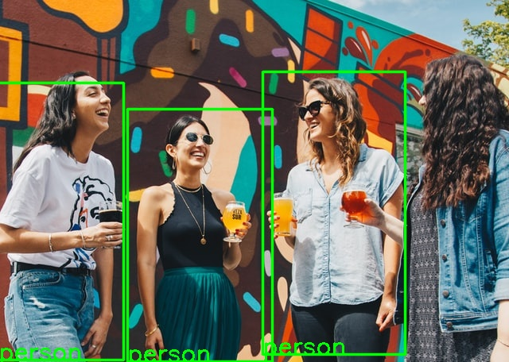

This project is dedicated to different forms of implementation of EfficientDet network for object detection via TensorFlow Lite [see paper here](https://arxiv.org/abs/1911.09070).

# Final Project

In the final project I made several changes from the previous iteration of the project:

- __Improved modularization__:
    - I created a separate `edet_tflite.py` file with necessary functions for the module
    - I created a separate `demo.py` file with an implementation of a demo. Also I added a possibility to specify arguments (image path and number of objects to detect)
- __Improved weight__:
    - I used `tflite-runtime` instead of `tensorflow`. This change saves more space for the project and relaxes the requirements for the hardware. For example, it is easier to deploy these types of projects on mobile devices or raspberry pi computers
- __Improved testing__:
    - I added several additional conditions for regression test to make it more robust
- __Improved functionality__:
    - I added object labels on images
    - I added a possibility to specify confidence interval for objects

# How to use this project?

This branch contains both: a package and a Docker application. It is not an ideal setup, and was created only for the purpose of this project

## How to work with a packaged model?

### Step 1. Install Poetry

```bash
curl -sSL https://raw.githubusercontent.com/python-poetry/poetry/master/get-poetry.py | python -
```

### Step 2. Clone repository

```bash
git clone https://github.com/AlexByzov93/cv_ml_project.git

cd cv_ml_project/app
```

### Step 3. Install dependencies

```bash
poetry install
```

### Step 4. Start a Poetry shell for the project

```bash
poetry shell
```

### Step 5. Check demo.py

`demo.py` allows you to use EffecientDet for any image in the `images` folder. If you want to add your own images, just copy them there. `demo.py` allows you to specify two additional arguments:

- `--img_path` - relative image path, default: `images/people.jpeg`
- `--n_boxes` - number of objects to detect, default: `images/people.jpeg`

Examples:

```bash
python3 demo.py # default values
python3 demo.py --img_path images/dog.jpeg # will detect three object on dog.jpeg
python3 demo.py --img_path images/dog.jpeg --n_boxes 1 # will detect one object on dog.jpeg
```

Default input:

Default output:


## How to work with a dockerized application?

### Step 1. Clone repository

```bash
git clone https://github.com/AlexByzov93/cv_ml_project.git

cd cv_ml_project
```

### Step 2. Build Docker image

```
sudo docker build -t cv_ml_project_final .
```

### Step 3.  Run application

```
sudo docker run -p 8501:8501 cv_ml_project_final
```