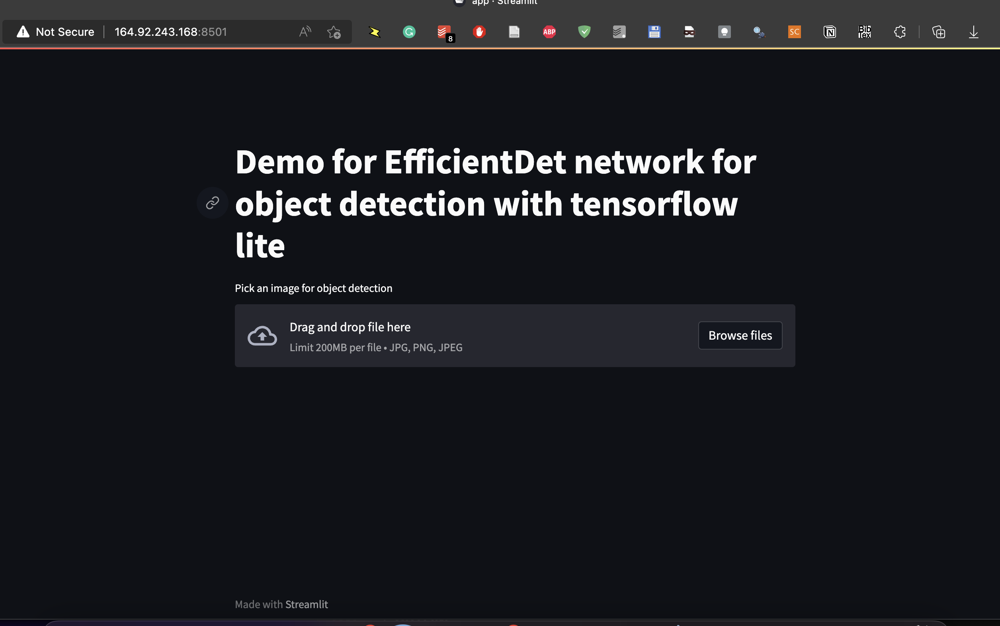
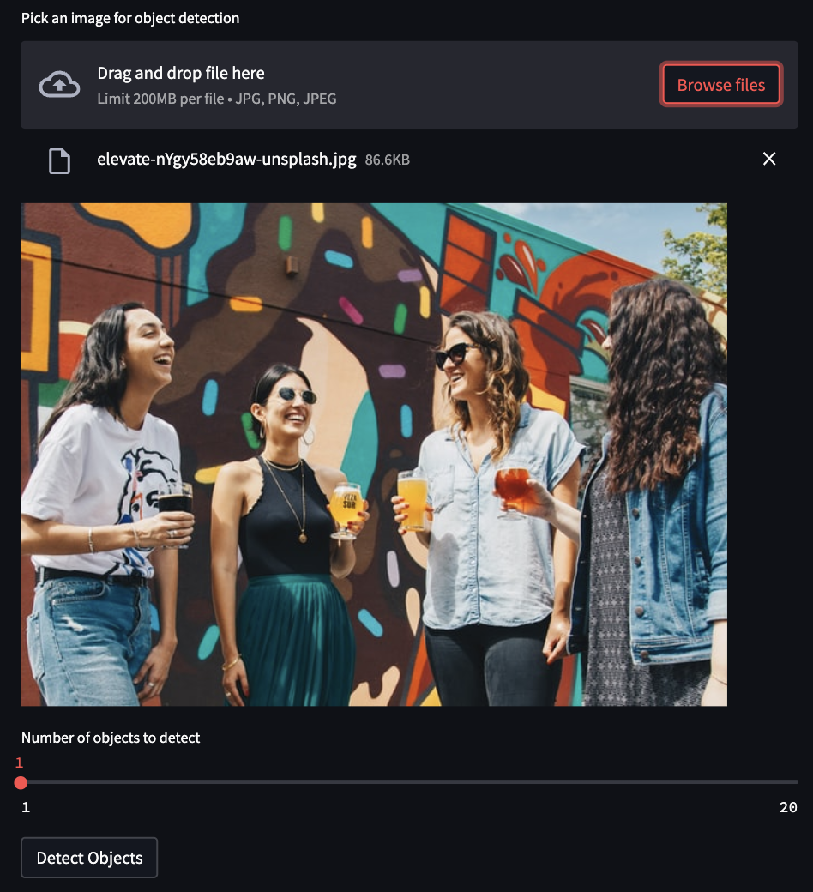
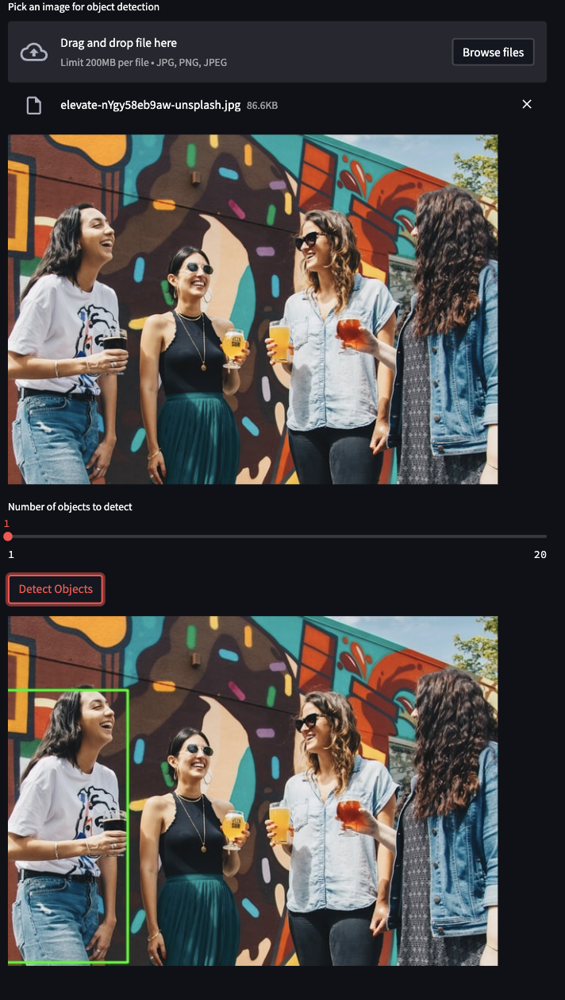
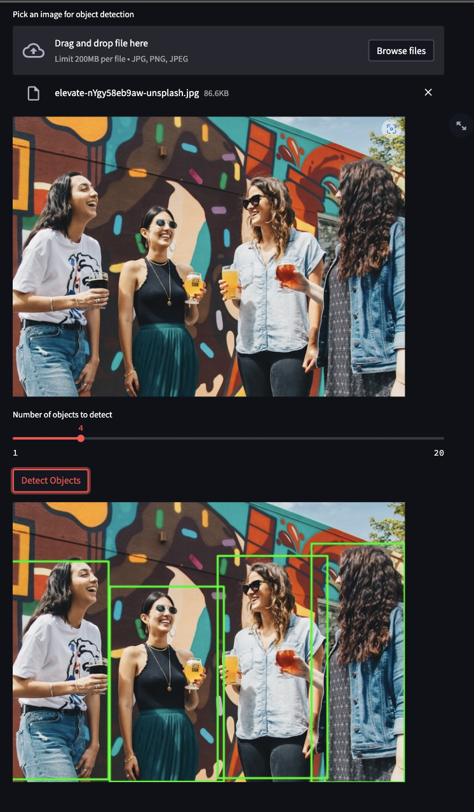

This project is dedicated to different forms of implementation of EfficientDet network for object detection via TensorFlow Lite [see paper here](https://arxiv.org/abs/1911.09070).

# Task 3

This task is dedicated to creating a demonstational application for object detection with Streamlit and Docker. To run it, you need to follow these steps:

## Step 1. Cloning git

```bash
git clone -b task_3 https://github.com/AlexByzov93/cv_ml_project.git

cd cv_ml_project
```

## Step 2. Initialize build from Dockerfile

```bash
sudo docker build -t cv_ml_project_task_3 .
```

## Step 3. Run application

```bash
sudo docker run -p 8501:8501 cv_ml_project_task_3
```

# Screenshots of the application

Credits for the used image - [Elevate from Unsplash](https://unsplash.com/photos/nYgy58eb9aw)

Initial View of the app:



Uploading an image to the app:



View after pressing on "Detect objects" button:



View after pressing on "Detect objects" button and change "Number of objects":




