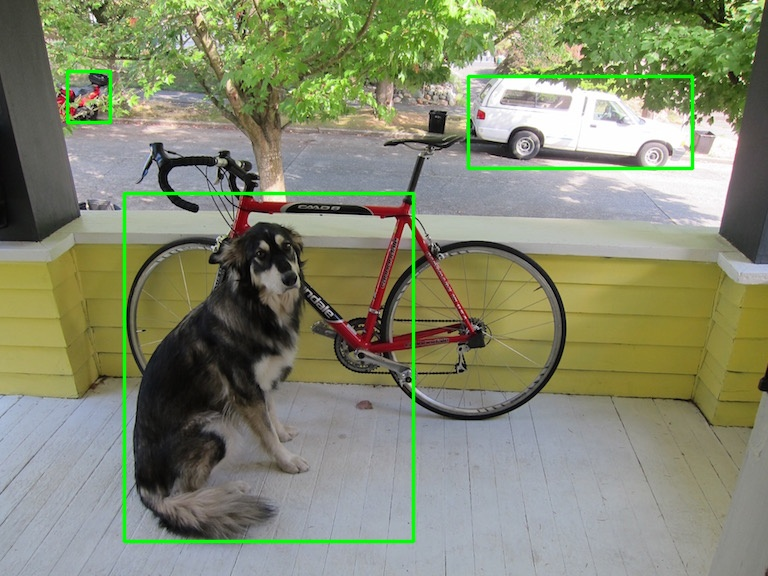

This project is dedicated to different forms of implementation of EfficientDet network for object detection via TensorFlow Lite [see paper here](https://arxiv.org/abs/1911.09070).

# Task 1.1.

In this task we needed to create a virtual environment that allows to use a `demo.py` script to detect objects on a pre-defined image.

## Step 1. Create a virtual environment

Disclaimer: This project was tested on a Linux Server (Ubuntu 20.04.), and I cannot guarantee for it to work on any platform. For example, if you use Windows machine, you need to use a slightly different syntax for activating a virtual environment. Also, if you use a Mac machine on M processes, you need to install Tensorflow for it.

To create a virtual environment, use these two command in your bash:

```bash
#pip3 install virtualenv - use this line, if you have not installed virtualenv package
#sudo apt install python3-pip - use this line, if you do not have a python3-pip  and repeat previous command
python3 -m venv efficientdet_tflite
#sudo apt install python3.8-venv - use this line, if you cannot create virtual environments on Linux
source efficientdet_tflite/bin/activate
```

## Step 2. Install libraries

To install necessary libraries, you can use prepared `requirements.txt` file

```bash
pip3 install -r requirements.txt
```

## Step 3. Use demo.py file

To use demo, you can use the following bash line:

```bash
python3 demo.py
```

# Results

If everything works correct, you should see the following picture:


Original:


# Troubleshooting

You might have a problem with cv2 library in python, if you work with Ubuntu Linux Server, because it does not have `libsglu1` file. To solve this problem, you can use the following bash command:

```bash
sudo apt install libglu1-mesa-dev
```

This and many other problems could be easily overcomed with Docker image.